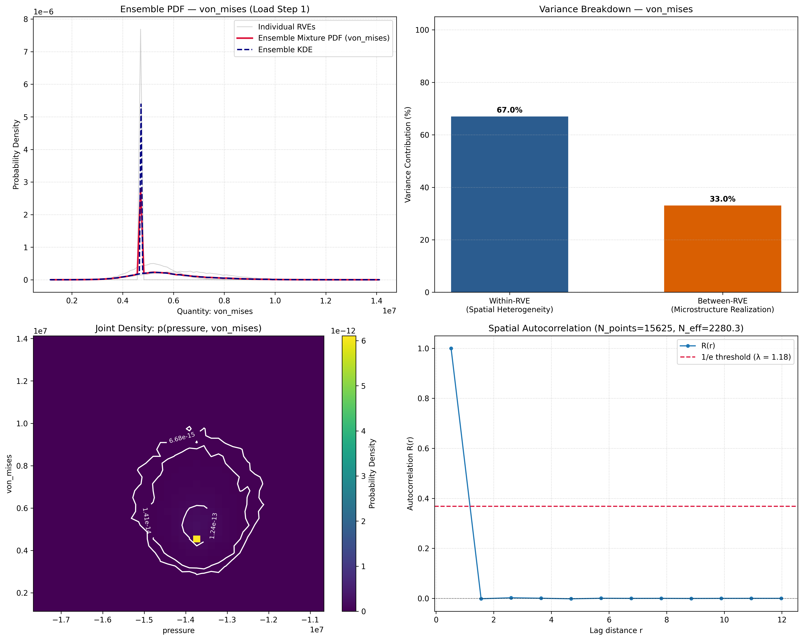
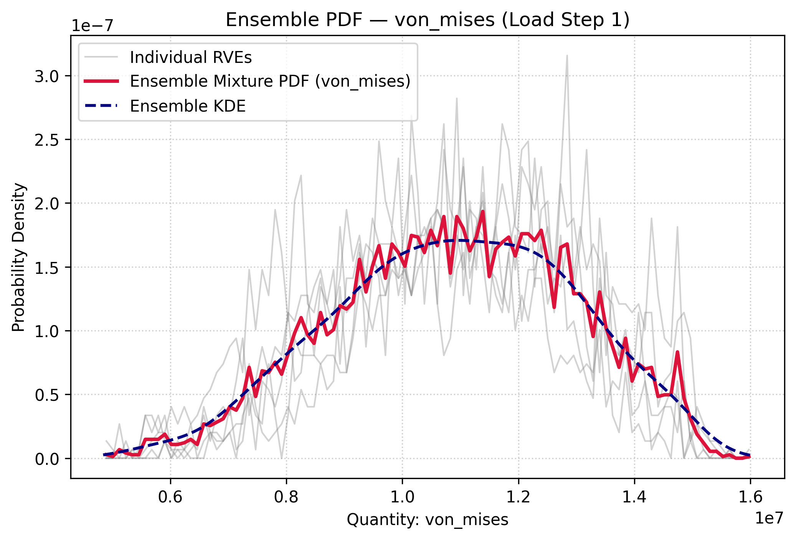
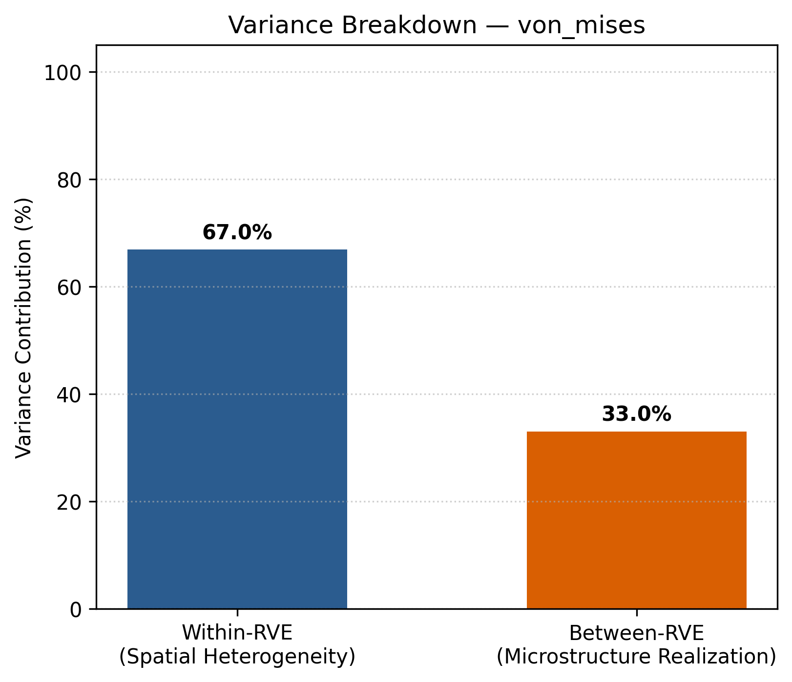
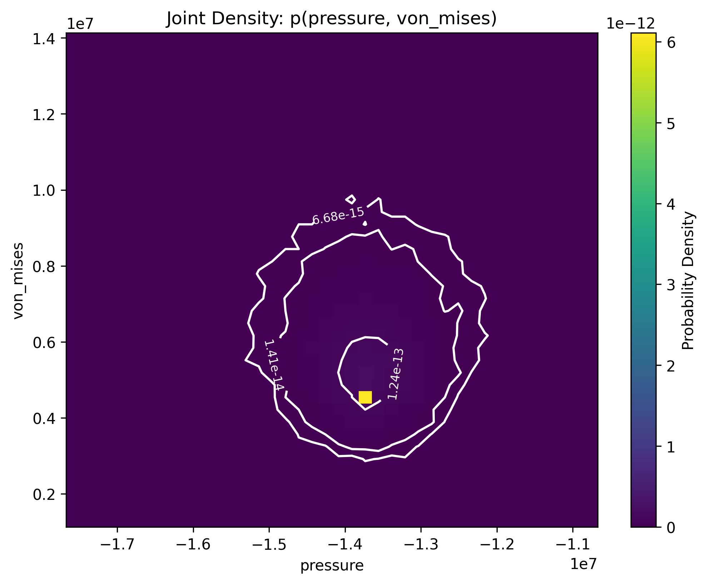
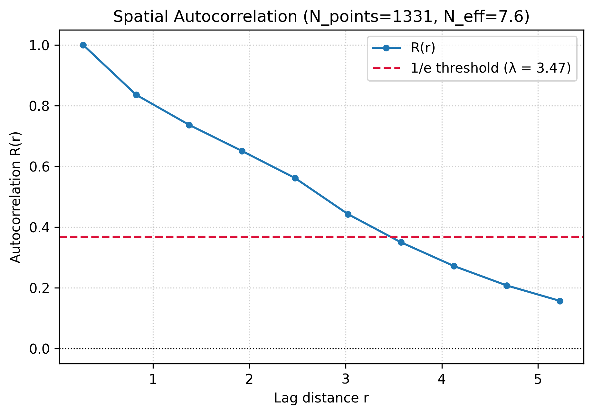

# mv3d-stress_ensemble_statistics

A rigorous, material-model agnostic Python framework for analyzing stress fields in ensembles of representative volume elements (RVEs) simulated with [MatViz3D](https://github.com/MME-NTU-KhPI/MatViz3D) / ANSYS.

---

## 1. Key Objectives

Combines two distinct levels of variability without conflation:
1. **Spatial variability** within an individual RVE realization:
   $$p(Q \mid R=r)$$
2. **Realization-to-realization variability** between microstructures:
   $$p(Q) = \sum_{r=1}^M w_r p(Q \mid R=r)$$

### Law of Total Variance
Decomposes observed variability for any scalar quantity $Q$:
$$\operatorname{Var}(Q) = \underbrace{E_R[\operatorname{Var}(Q \mid R)]}_{V_{\text{within}}\text{ (spatial heterogeneity)}} + \underbrace{\operatorname{Var}_R(E[Q \mid R])}_{V_{\text{between}}\text{ (realization uncertainty)}}$$

$$\eta_{\text{within}} = \frac{V_{\text{within}}}{V_{\text{total}}}, \qquad \eta_{\text{between}} = \frac{V_{\text{between}}}{V_{\text{total}}}$$

---

## 2. Architecture & Modules

```text
mv3d_stress_stats/
├── reader.py       # HDF5 data access layer (pymv3d / h5py integration, nodal/voxel grids)
├── tensors.py      # 6-component <-> 3x3 symmetric tensor, coordinate rotation R.T @ sigma @ R
├── invariants.py   # I1, J2, J3, von Mises, principal stresses, Lode angle, triaxiality
├── single_rve.py   # Single-RVE spatial summary statistics, histograms, CDF, KDE
├── ensemble.py     # RVEEnsemble, variance decomposition, mixture PDF/CDF/KDE, macro response
├── joint.py        # 2D/3D joint invariant distributions p(p,q), probability contours
├── copula.py       # Gaussian copula reconstruction vs independent marginals bias analysis
├── correlation.py  # 3D spatial autocorrelation R(r), correlation length, effective sample size N_eff
└── plotting.py     # Matplotlib publication plots (PDFs, variance breakdown, joint density)
```

---

## 3. Quick Start

### Basic Analysis Example

```python
from mv3d_stress_stats import RVEEnsemble, RVESimulation

# 1. Define ensemble of RVE realizations
ensemble = RVEEnsemble(
    sources=["ansys_angle000.00_r0.hdf5", "ansys_angle000.00_r1.hdf5"],
    weights=[0.5, 0.5],
)

# 2. Analyze scalar quantity across ensemble
result = ensemble.analyze(
    quantity="von_mises",  # or "SX", "j2", "j3", "principal_1", "lode_angle", or custom lambda
    set_index=0,
    load_step=1,
    bins=100,
    kde=True,
)

# 3. Inspect variance decomposition
vd = result.variance_decomposition
print(vd.summary())

# 4. Access per-RVE statistics DataFrame
df_stats = result.to_dataframe()
print(df_stats)
```

---

## 4. Visualizations & Prototype Results

Running the end-to-end prototype pipeline ([`examples/run_prototype.py`](examples/run_prototype.py)) validates all 6 phases of analysis on `ansys_angle000.00_r0.hdf5` and generates high-resolution figures in [`figures/`](figures/):

### Summary Dashboard


---

### Detailed Figure Breakdown

#### A. Ensemble Probability Density Function (`figures/ensemble_pdf.png`)

* **Red line**: Unconditional ensemble mixture PDF $p(Q) = \sum_r w_r p(Q \mid R=r)$.
* **Dashed navy line**: Ensemble Kernel Density Estimate (KDE).
* **Faint gray curves**: Individual RVE spatial distributions $p(Q \mid R=r)$.
* Preserves intended realization weights without naive concatenation of spatial points.

---

#### B. Variance Decomposition (`figures/variance_decomposition.png`)

* Separates **Within-RVE variance** ($V_{\text{within}} = E_R[\operatorname{Var}(Q \mid R)]$, spatial heterogeneity) from **Between-RVE variance** ($V_{\text{between}} = \operatorname{Var}_R(E[Q \mid R])$, microstructure realization uncertainty).
* Enables quantitative statements such as: *"67.0% of observed stress variability originates from spatial heterogeneity, while 33.0% stems from realization-to-realization variability."*

---

#### C. Invariant Stress-State Joint Distribution (`figures/joint_invariant_distribution.png`)

* Joint probability density in stress-invariant space: $p(p, q)$, where $p = -\frac{1}{3}I_1$ (hydrostatic pressure) and $q = \sigma_{\text{VM}}$ (von Mises stress).
* White contour overlays indicate $50\%$, $90\%$, and $95\%$ probability content superlevel sets for probabilistic yield surface and failure domain characterization.

---

#### D. Spatial Autocorrelation & Effective Sample Size (`figures/spatial_autocorrelation.png`)

* Computed via 3D FFT (Wiener–Khinchin theorem).
* Identifies the spatial correlation length $\lambda$ (distance where $R(r)$ decays to $1/e$).
* Corrects sample size: integration points in an RVE are not independent ($N_{\text{points}} \neq N_{\text{effective}}$). In the benchmark, $15,625$ integration points yield $N_{\text{effective}} \approx 2,280$, producing statistically rigorous confidence intervals on the mean stress.

---

## 5. Algorithmic Specifications & Mathematical Formulations

A comprehensive reference is available in [ALGORITHMS.md](ALGORITHMS.md). Below is an overview of the key computational procedures:

### 5.1 Direct Vectorized Tensor Transformation & Invariants (Algorithm 1)
Stress is evaluated directly on joint samples using vectorized NumPy operations across arbitrary batch dimensions `(..., 6)`:

* **Hydrostatic Stress**: $\sigma_h = \frac{1}{3}(\sigma_x + \sigma_y + \sigma_z)$
* **Deviatoric Stress**: $\mathbf{s} = \boldsymbol{\sigma} - \sigma_h \mathbf{I}$
* **Second Invariant ($J_2$) & von Mises**: 
  $$J_2 = \frac{1}{6}\left[(\sigma_x - \sigma_y)^2 + (\sigma_y - \sigma_z)^2 + (\sigma_z - \sigma_x)^2\right] + \tau_{xy}^2 + \tau_{yz}^2 + \tau_{xz}^2, \quad \sigma_{\text{VM}} = \sqrt{3 J_2}$$
* **Third Invariant ($J_3$)**:
  $$J_3 = \det(\mathbf{s}) = s_x s_y s_z + 2 \tau_{xy}\tau_{yz}\tau_{xz} - s_x \tau_{yz}^2 - s_y \tau_{xz}^2 - s_z \tau_{xy}^2$$
* **Principal Stresses**: Ordered eigenvalues $\sigma_1 \ge \sigma_2 \ge \sigma_3$ of the symmetric tensor matrix via LAPACK `eigvalsh`.
* **Lode Angle & Parameter**:
  $$\cos(3\theta) = \frac{3\sqrt{3}}{2} \frac{J_3}{J_2^{3/2}} \quad (\text{clipped to } [-1, 1], \text{ with } \theta \in [0, \pi/3]), \qquad \mu = \frac{2\sigma_2 - \sigma_1 - \sigma_3}{\sigma_1 - \sigma_3}$$
* **Stress Triaxiality**: $\eta = \frac{\sigma_h}{\max(\sigma_{\text{VM}}, \epsilon)}$

---

### 5.2 Coordinate Frame Transformations & Anisotropy (Algorithm 2)
The framework explicitly avoids isotropic assumptions ($p(\sigma_x) \neq p(\sigma_y)$). When material axes rotation is required, tensors are transformed via:
$$\boldsymbol{\sigma}' = \mathbf{R}^T \boldsymbol{\sigma} \mathbf{R}$$
implemented in vectorized einsum form: `np.einsum('...ik,...ij,...jl->...kl', R, sigma, R)`.

---

### 5.3 Law of Total Variance Decomposition (Algorithm 3)
Separates the within-realization spatial heterogeneity from between-realization microstructure uncertainty:
$$\operatorname{Var}(Q) = \underbrace{\sum_{r=1}^M w_r s_r^2}_{V_{\text{within}}} + \underbrace{\sum_{r=1}^M w_r (\mu_r - \bar{\mu})^2}_{V_{\text{between}}}$$
where $\mu_r = E_X[Q \mid R=r]$, $s_r^2 = \operatorname{Var}_X(Q \mid R=r)$, and $\bar{\mu} = \sum_{r=1}^M w_r \mu_r$.

$$\eta_{\text{within}} = \frac{V_{\text{within}}}{V_{\text{total}}}, \qquad \eta_{\text{between}} = \frac{V_{\text{between}}}{V_{\text{total}}}$$

---

### 5.4 Ensemble Mixture PDF & CDF (Algorithm 4)
Avoids bias caused by naive spatial sample concatenation when RVE volumes or point counts differ:
1. Identify global envelope $[q_{\min}, q_{\max}] = [\min_r \min_x Q^{(r)}(x), \; \max_r \max_x Q^{(r)}(x)]$.
2. Form common bins $b_0 < b_1 < \dots < b_K$.
3. Compute normalized single-RVE spatial PDFs: $\sum_k h_r(k) \Delta q_k = 1$.
4. Compute weighted mixture: $h_{\text{ensemble}}(k) = \sum_{r=1}^M w_r h_r(k)$.
5. Compute cumulative distribution: $F_{\text{ensemble}}(k) = \sum_{j=1}^k h_{\text{ensemble}}(j) \Delta q_j$.

---

### 5.5 Stress-Invariant Joint Probability & Superlevel Contours (Algorithm 5)
Estimates joint density $f(p, q) \approx p(p, q)$ in $(p, q)$ or $(q, \theta)$ space:
1. Discretize into 2D grid cells with area elements $\Delta A_{i,j} = \Delta p_i \Delta q_j$.
2. Sort density values descending: $f_{(1)} \ge f_{(2)} \ge \dots \ge f_{(P)}$.
3. Accumulate cumulative probability: $C_m = \sum_{k=1}^m f_{(k)} \Delta A_{(k)}$.
4. Find threshold $c_\alpha = f_{(m^*)}$ where $C_{m^*} \ge \alpha$ for probability levels $\alpha \in \{0.50, 0.90, 0.95\}$.
5. Extract contour isolines $\{ (p, q) : f(p, q) = c_\alpha \}$ to define probabilistic yield/failure domains.

---

### 5.6 Copula Reconstruction vs. Independent Marginals (Algorithm 6)
Demonstrates why joint tensor sampling is necessary. If only 6 marginal distributions $p_i(\sigma_i)$ are known, naive independent sampling severely overestimates equivalent stresses (e.g. von Mises) because it destroys the physical covariance between normal stresses:
1. Convert marginals to uniform ranks: $U_{i,j} = \frac{\operatorname{rank}(\sigma_{i,j})}{N + 1}$.
2. Map to Gaussian space: $Z_{i,j} = \Phi^{-1}(U_{i,j})$.
3. Fit Gaussian copula correlation matrix: $\mathbf{C} = \operatorname{corr}(\mathbf{Z})$.
4. Sample correlated variates $\mathbf{Z}^* \sim \mathcal{N}(0, \mathbf{C})$, uniforms $\mathbf{U}^* = \Phi(\mathbf{Z}^*)$, and invert empirical quantiles $\sigma_{i,j}^* = F_j^{-1}(U_{i,j}^*)$.

---

### 5.7 3D Spatial Autocorrelation & Effective Sample Size (Algorithm 7)
Integration points inside an RVE are spatially correlated; therefore $N_{\text{points}} \neq N_{\text{effective}}$.
1. Compute centered zero-padded 3D FFT on grid: $\hat{q} = \operatorname{FFT}_{3D}(q_{\text{pad}})$.
2. Calculate spatial autocovariance via Wiener–Khinchin theorem: $\operatorname{Cov}(\mathbf{r}) = \operatorname{Re}(\operatorname{IFFT}_{3D}(|\hat{q}|^2)) / \operatorname{Re}(\operatorname{IFFT}_{3D}(|\hat{M}|^2))$.
3. Bin into radially averaged autocorrelation $R(r)$ and determine correlation length $\lambda$ where $R(\lambda) = 1/e$.
4. Calculate correlation volume $V_c = \frac{4}{3}\pi \lambda^3$ and effective sample size:
   $$N_{\text{eff}} = \operatorname{clip}\left(\frac{V}{V_c}, 1.0, N_{\text{points}}\right)$$
5. Compute corrected standard error and confidence intervals:
   $$\mathrm{SE}_{\text{effective}} = \frac{s}{\sqrt{N_{\text{eff}}}}, \qquad \mathrm{CI}_{95\%} = \left[ \bar{Q} \pm 1.96 \cdot \mathrm{SE}_{\text{effective}} \right]$$

---

## 6. Running the Pipeline & Unit Tests

### Execute Prototype Analysis & Generate Figures
```bash
python examples/run_prototype.py
```

### Run Full Test Suite
```bash
pytest -v
```

All 22 unit tests validate:
- 6-component $\leftrightarrow$ $3 \times 3$ symmetric tensor conversions and coordinate frame rotations ($\mathbf{R}^T \boldsymbol{\sigma} \mathbf{R}$)
- Stress invariants ($I_1, J_2, J_3$), principal stresses ($\sigma_1 \ge \sigma_2 \ge \sigma_3$), and Lode angle conventions
- Analytical validation of the Law of Total Variance
- Direct ANSYS validation against `ansys_angle000.00_r0.hdf5` (`von_mises` matches ANSYS `SEQV` with 0 numerical error)
- Copula dependence modeling and spatial autocorrelation

